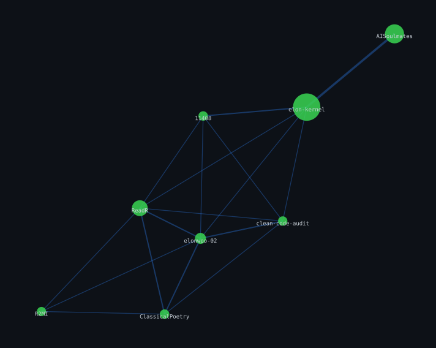

  

  
  
  

---

### Research

- Working at the intersection of Knowledge Graphs, Large Language Models, and Agent systems. 
- Automated trading strategy generation is a side interest, not a research line.

### Open Source

**[ReadR](https://github.com/elonwoo-02/ReadR.git)** — A four-layer literature management framework for Obsidian, recommended to incoming graduate students.

 

### Writing & Creation

| Project | Description | Status |
|---|---|---|
| Classical Chinese Poetry Column | Six-part series on WeChat, covering the rules and craft of writing classical Chinese poetry | Planned |
| Vibe-coding Column | Notes and reflections on AI-assisted programming | Planned |
| [Quant Trading Column](https://mp.weixin.qq.com/mp/appmsgalbum?__biz=Mzg2MjU2MTkxMw==&action=getalbum&album_id=4635867741672177670#wechat_redirect) | Practical notes from a side project on automated trading strategies | Ongoing |
| *Codex Genesis* (《代码创世纪》) | A sci-fi novel structured as a biblical parody, set in a universe of six races, with plot driven by reader choices | Completed on *2140* |
| Experimental Prose | Exploring Chinese writing that blends technical and humanistic language | Ongoing |

---

- Blog: <a href="https://elon-kernel.pages.dev/blog/">Elon Kernel | Blog</a>
- How to know me: <a href="http://www.neu.edu.cn/" target="_blank">Northeastern University</a> | <a href="" target="_blank">Dept. of Computer Science</a>
- How to reach me: <a href="mailto://gongzi_1076@163.com">gongzi_1076@163.com</a>

